# Oneworld Explorer - 旅行編 (1)

このエントリは、[圧倒的令和ッ！！ぴょこりんクラスタ Advent Calendar 2019](https://adventar.org/calendars/3876)のために書かれたものです。

内容としては、[実践編](#5)の続きです。実際にOneworld Explorerで旅行をしたときの旅行記です。
2018年の旅行記ですが、写真の整理やこの記事の執筆は紛うことなく2019年に書かれたものです。

そんなわけで、いよいよこのブログも6つ目にして普通のブログみたいな記事・・・になる予定だったのですが、正直1年以上たっていると記憶もあいまいで
あんまり書くことがないのでちょっと困っております。

まあ、一応、前の記事で書くということにしていたので、なんとかひねり出すことで、その義務(?)は果たしておくことにします。

## 0．出発前

### E-ticket

当然Oneworld Explorerも普通の航空券ですので、購入するとE-ticket控えが手に入ります。

そして当たり前なのですが16区間もありますので、なんと注意書き等を除いた旅程の部分だけで2ページにわたっています。

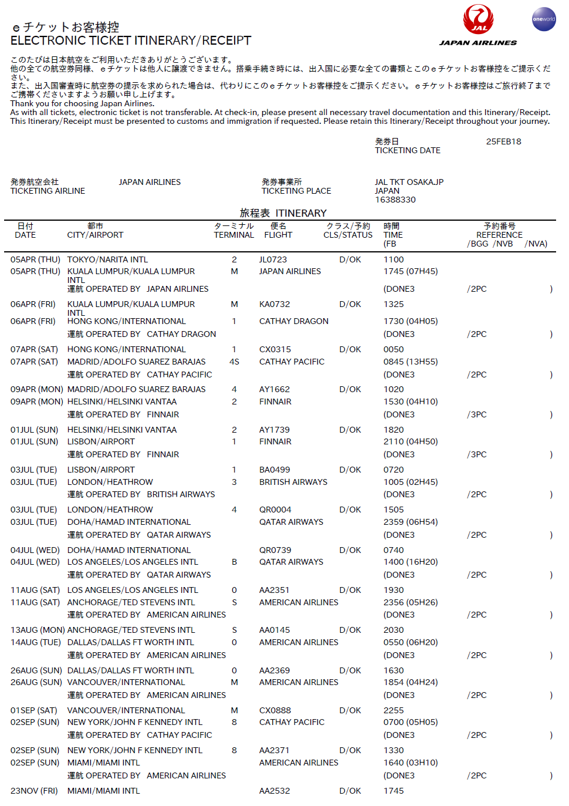

まあ実際これを使うことはないわけですけど、とりあえず保管しておくと、なんとなく自己満足に浸ることができるでしょう。

### 乗り継ぎ

この予約、JALのWebから見ることができます。開くと常に何らかのエラーが表示されていたり、座席指定以外の諸々の機能はまったく使い物になりませんでしたが、ともかくもちゃんと予約されて購入されることは確認できます。
表示上では、16の区間にわかれているわけでなく、下記の9つの旅程となっていました。

1. NRT-KUL-HKG-MAD
2. MAD-HEL
3. HEL-LIS
4. LIS-LHR-DOH-LAX
5. LAX-ANC
6. ANC-DFW
7. DFW-YVR
8. YVR-JFK-MIA
9. MIA-BOS-HKG-NRT

これは、ある便の到着時刻からその次の便の出発時刻が24時間以内だと乗り継ぎとみなされるためのようです。
そのために、空港でのチェックイン時には、最初の空港で複数枚のチケットが発券されることになります。
ただ、それだと、チェックインした航空会社とは違う航空会社のチケットについては、チェックイン情報（入国情報とか）が
不十分だったりするようで、結局ゲートのカウンターに呼ばれたりして、新しい航空券を渡されたりもしました。

とはいえ、LIS-LHR-DOH-LAX なんて頭のおかしいルート3枚のチケットでも、驚かれたりされずに(特に何も言われずに)発券されたので、
(もちろん国や担当者の人にもよると思いますが)そんなに珍しいことでもないようです。

なお、航空券の乗り継ぎとは別に、今回の旅行は下記の5部構成となっています。
Oneworld Explorerの16区間を一気に一つの旅行で乗るのでなく、途中で中断して、別の航空券で家などに戻り、しばらくしてからまた再開するという形で、5回に分けています。

- 第1部: NRT - HEL (上記の1と2)
- 第2部: HEL - LAX (上記の3と4)
- 第3部: LAX - DFW (上記の5と6)
- 第4部: DFW - MIA (上記の7と8)
- 第5部: MIA - NRT (上記の9)

これは、一回で必要な休暇の日数を減らすため、路線が季節運航のため、別の出張や用事とくっつけるため、などのいろいろな理由を勘案した結果となっております。

### そのほか

なお、JALのWebからは、一部座席指定ができない便がありました(確かBAとか)。そういう場合には、各社のWebに行って、予約番号を入れると、その航空会社からでも同じ予約を見ることができますので、少なくともその航空会社の座席であれば指定することができるはずです。

うまくいけばモバイルチケットが使えたり使えなかったりします。この辺の挙動はどうも各社とも怪しいので、いろいろと試したりするのがよいでしょう。

## 第1部: 東京～クアラルンプール～香港～マドリード～ヘルシンキ

### 1. JL 723 (NRT -> KUL)

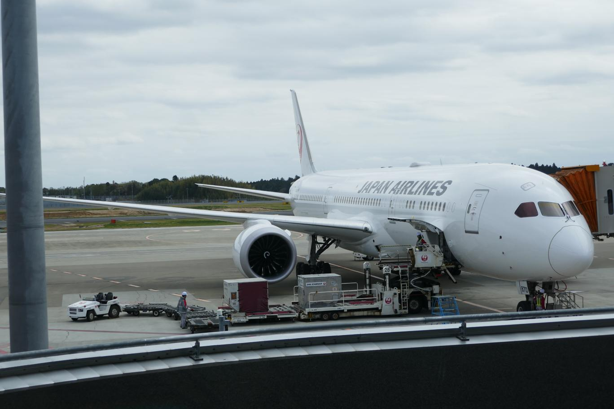

| 項目 | 内容 |
|-----|---------|
| 便名 | JL 723 |
| 出発地 | 成田国際空港 (日本) |
| 到着地 | クアラルンプール国際空港 (マレーシア) |
| 予定 | 11:00 ⭢ 17:45 |
| 実績 | 11:08 ⭢ 17:42 (7h34m) |
| 機種・機体番号 | B787-9 (JA870J) |

修行路線の一部として有名なクアラルンプール路線ですが、実は個人的にはクアラルンプールは初めてでした。

### 1.5 Kuala Lumpur

まずは空港から市内までKLIA Ekspresを利用しました。非常に快適で、スピードも速く(140 km/hは出ていた気がする)、素晴らしい乗り物でした。
先進国でありながら、空港へのアクセス鉄道というものがいまいちなどこかの国とは大違いですね。

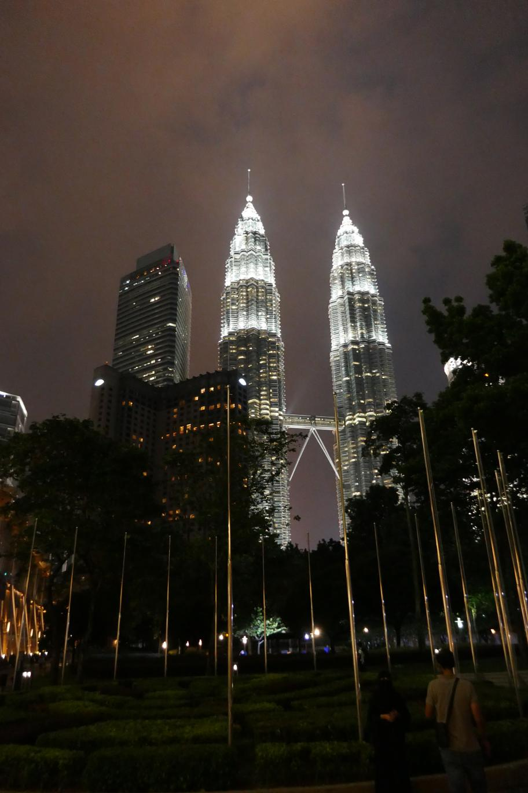

しかし市内には移動しましたが、次の便までそんなに時刻があるわけでもないので、単にクアラルンプール市内に宿泊しただけという感じになりました。

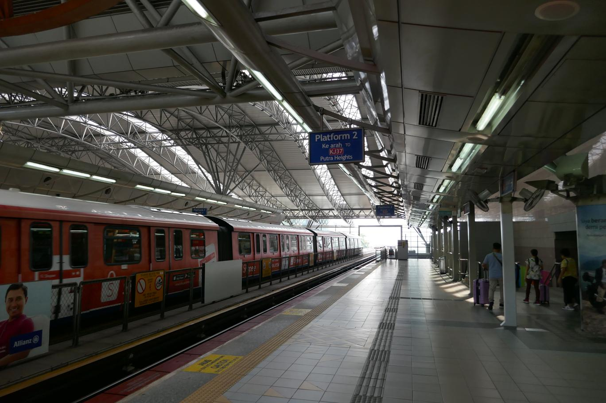

それでも、翌朝、メトロに少しだけ乗りました。

### 2. KA 732 (KUL -> HKG)

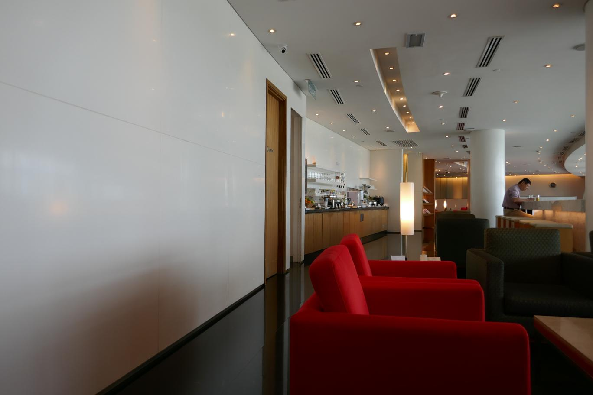

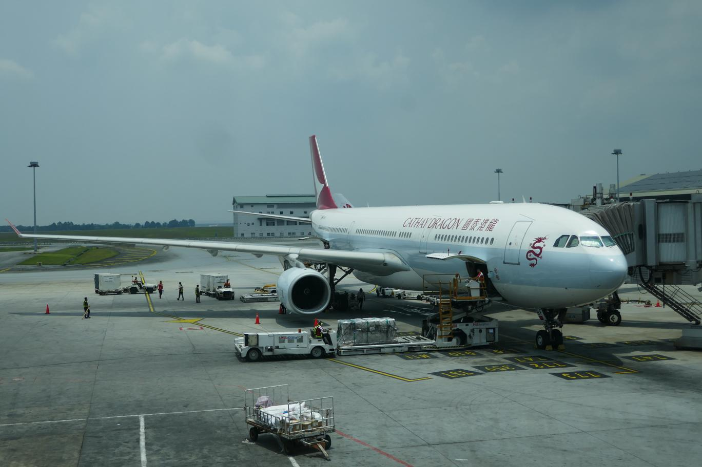

| 項目 | 内容 |
|-----|---------|
| 便名 | KA 732 |
| 出発地 | クアラルンプール国際空港 (マレーシア) |
| 到着地 | 香港国際空港 (香港) |
| 予定 | 13:25 ⭢ 17:30 |
| 実績 | 14:04 ⭢ 18:12 (4h8m) |
| 機種・機体番号 | A330-300 (B-LBF) |

Cathay Dragonです。初めてのCathay系の搭乗でした。
この旅行においての唯一のトラブルが、この便で起きました。といっても、たいしたものではありませんでしたが。

ゲートからpush backが終わったところで、コンピュータに不具合があったのでエンジニアを呼んで再起動してもらうためにゲートに引き返す、というものでした。ゲートに戻って30分ほどしたら、再起動したので今度は大丈夫というアナウンスがあり、無事に出発することができました。

・・・とはいえ、コンピュータの障害が再起動で直るってそれ本当に直ってるのか、というかフライトコンピュータなんて安全系のシステムがそれでいいのかな、となかなか不安に思う出来事でありました。

何にせよ、その後は特に問題なく香港に到着し、到着は40分くらいの遅れでした。

乗り継ぎは非常に余裕があったので問題ありませんでした。KUL-HKGは何便も出ていたので、確かもう1本か2本後の便でもよかったのですが、余裕を持たせた甲斐があったというところですね。いや、40分の遅れなら、後の便で発生しても大丈夫だったはずですけど。

### 2.5 Hong Kong (Airport)

香港空港では、非常に評判の良いCathayのラウンジに行きました。なお、この時点では、JGCプレミア(エメラルド)に到達していなかったので、上級のラウンジは使えませんでした。それでも十分広く、食べ物もいろいろ選べ(ヌードルバーもあり)、シャワーもあり、仮眠できるところもあり、よいところでした。

問題があるとすれば、グローバルな空調設定なので、非常に寒かったことです。特に寝る場合には、それなりに厚い上着なり毛布なりがほしいところです。

### 3. CX 315 (HKG -> MAD)

| 項目 | 内容 |
|-----|---------|
| 便名 | CX 315 |
| 出発地 | 香港国際空港 (香港) |
| 到着地 | アドルフォ・スアレス・マドリード＝バラハス空港 (スペイン) |
| 予定 | 00:50 ⭢ 08:45 |
| 実績 | 00:55 ⭢ 08:50 (13h55m) |
| 機種・機体番号 | B777-300ER (B-HNR) |

今回のハイライト(飛行距離・時間的意味で)の一つでした。
出発時刻が遅かったので、非常に眠い状態で出発でした。

### 3.5 Aranjuez & Toledo

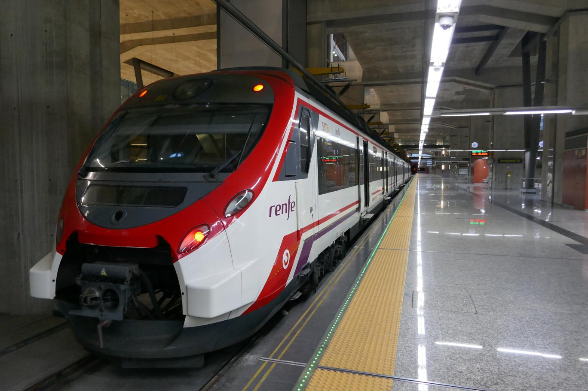

スペインといえばアランフェス協奏曲ということで、アランフェスに行きました。

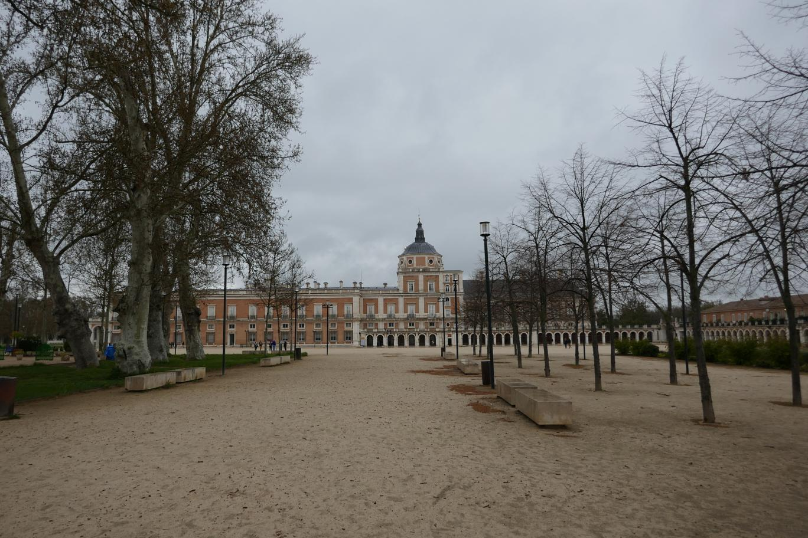

これも世界遺産なのですが、入り口のセキュリティの人たちが英語が通じなくてちょっと苦労しました。
（特に、バッグはロッカーに預けてと言っているのがわからず、その旨英語で書かれたパネルを見せられて理解した）
やはり、こういうところは最低限の英語が通じないとちょっと困りますね。公用語じゃないから当然仕方が無い面もありますし、アランフェスがマイナーであるということでもあるんでしょうけど・・・

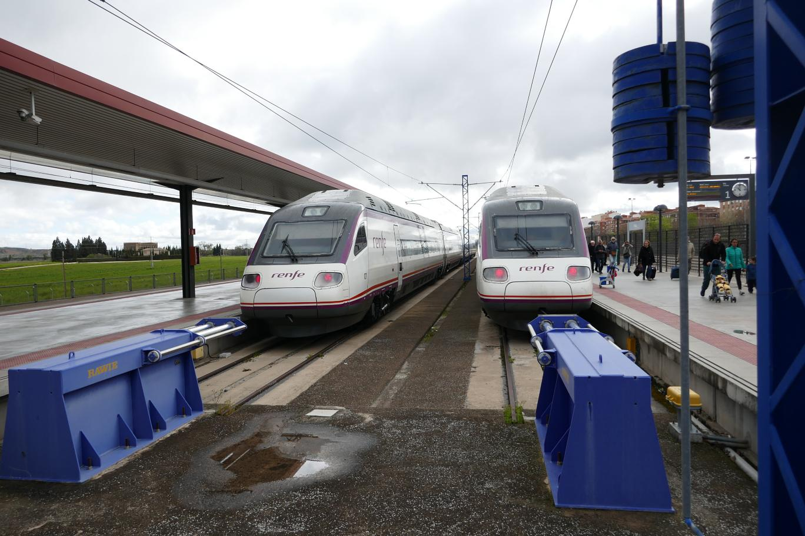

そして、renfeのAVEに乗ってトレドに行きました。こちらは、アランフェスよりはるかに大人気ですね。

ところで、この高速列車ですが、スペインでは、ホームでセキュリティチェックがあります。
ですが、X線画像をチェックする担当者が、用事だか雑談だかで目を離していたり(ベルトコンベヤを止めるわけでもなく)していたので、本当にこれ意味あるのかなあという緩い感じでした。
まあ飛行機と違って、時間かけることは無理ですからね。そこが落としどころなのでしょう。ええきっと。

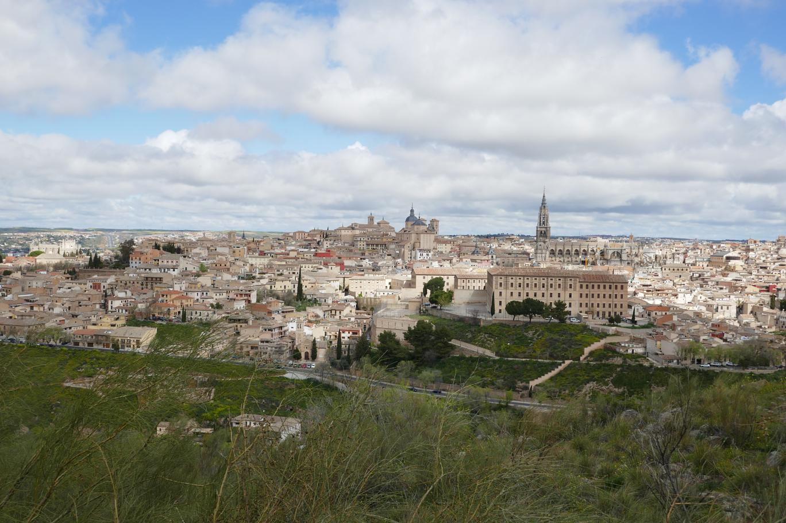

トレドを高台から撮ったものです。大変良いです。ヨーロッパなのです。(語彙不足)

結局、旅程全体では、マドリード周辺が一番まともに観光した気がいたします。

### 4. AY 1662 (MAD -> HEL)

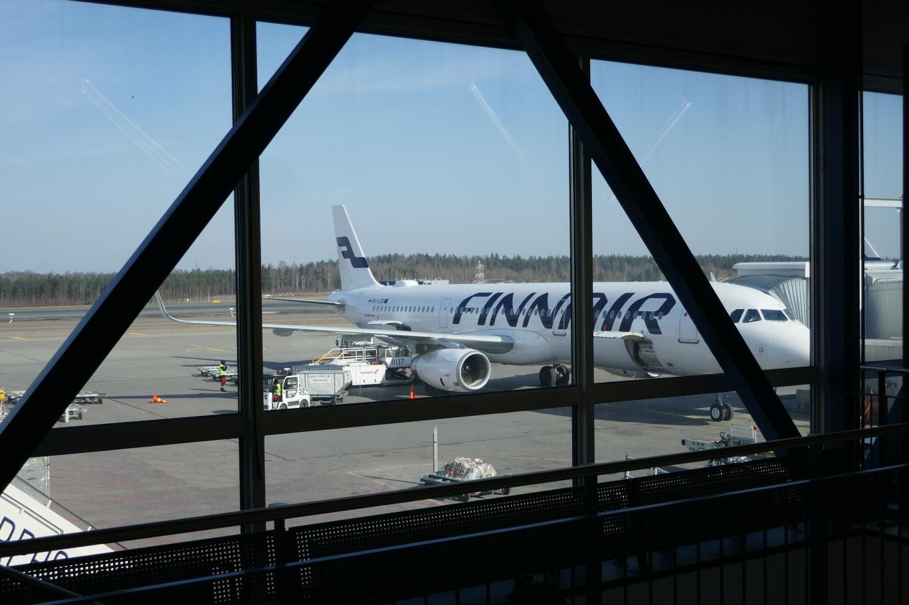

| 項目 | 内容 |
|-----|---------|
| 便名 | AY 1662 |
| 出発地 | アドルフォ・スアレス・マドリード＝バラハス空港 (スペイン) |
| 到着地 | ヘルシンキ・ヴァンター国際空港 (フィンランド) |
| 予定 | 10:20 ⭢ 15:30 |
| 実績 | 10:30 ⭢ 15:39 (4h09m) |
| 機種・機体番号 | A321-200 (OH-LZO) |

本旅行の第1部の最終セグメントです。
ビジネスクラスとはいえ、ヨーロッパ内路線なので、まあ国内線の上のクラスという感じです。
4時間なので長めではありますが、アメリカの国内線と比べるとたいしたことはありませんね。

なお、食事が出た後に、マフィンとかシナモンロールとかスイーツが無限に出てきて、これがヨーロッパなのかと思いました。
でも、次のHEL-LISではそこまで出なかったので、Finnairの標準サービスというわけでもないようです。なんだったんでしょうね。

### 4.5 Helsinki

フィンランドには久しぶりに入国したのですが、鉄道が空港に乗り入れており、市内に行くのが楽になっていました。

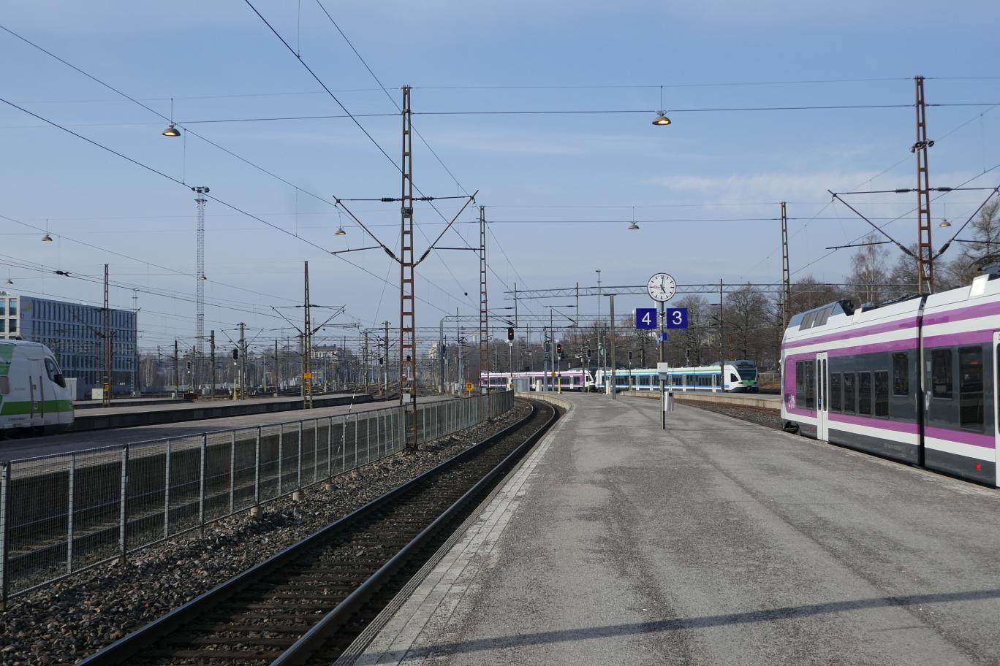

ヘルシンキでは、ヨーロッパらしい頭端駅を楽しみました。そんなに人口が多いわけでもないのですが、それでも結構ひっきりなしに
列車が到着したり、同時入線・出発も数多く見られたり、非常に満足できる駅でした。

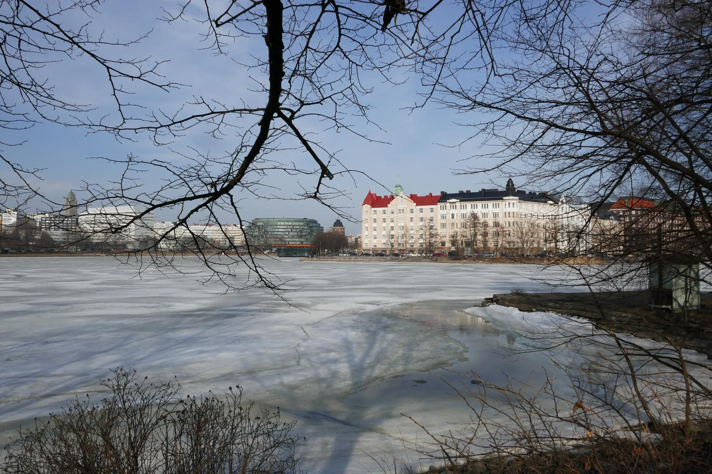

なお、ヘルシンキ中央駅の近くの湖(だと思っていたけど湾だった)はまだ凍っていました。

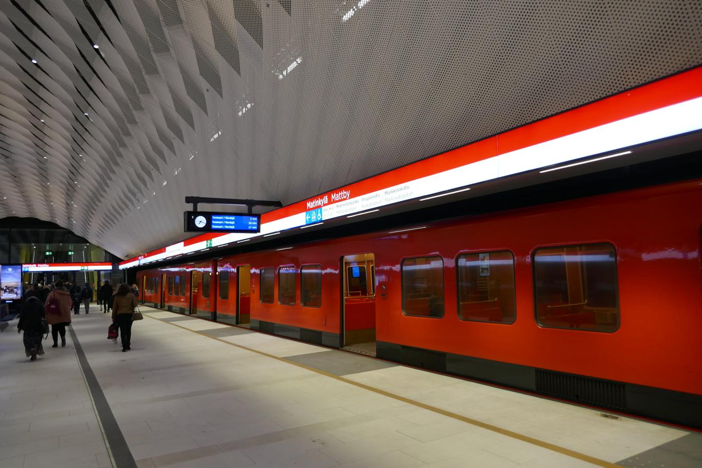

少し余裕があったので、ヘルシンキの地下鉄を乗りつぶしました。

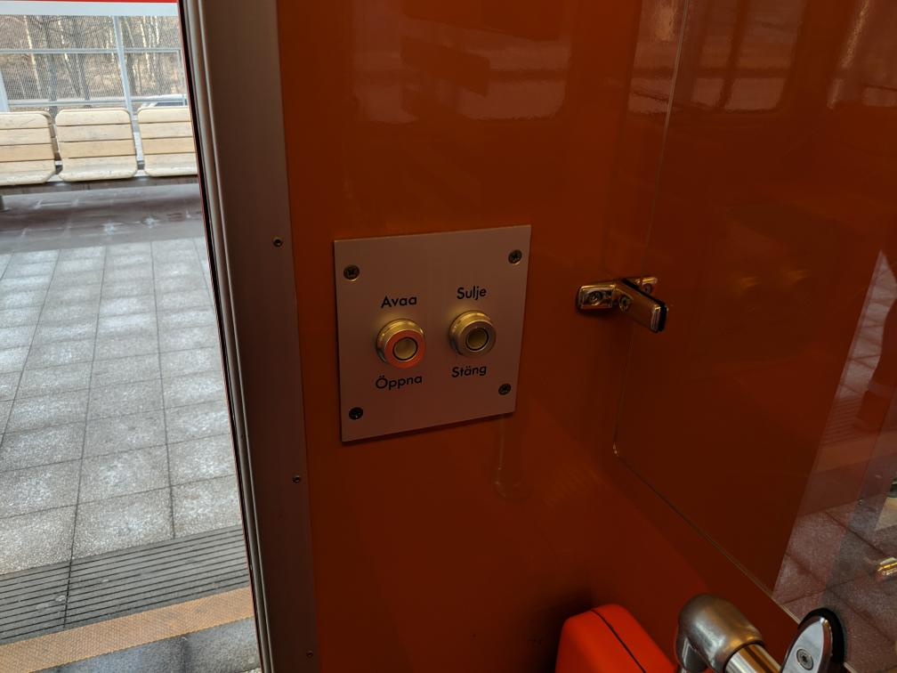

ただ、一部の車両のドアの開閉ボタンの説明がフィンランド語とスウェーデン語でしか書かれておらず究極の二択を迫られる仕様になっていました(幸いにして自分で開けることはなかったですが)。
まあ、スウェーデン語が書いてあるだけ幸いで、まだ左がOpenだろうと推測できることはできますが・・

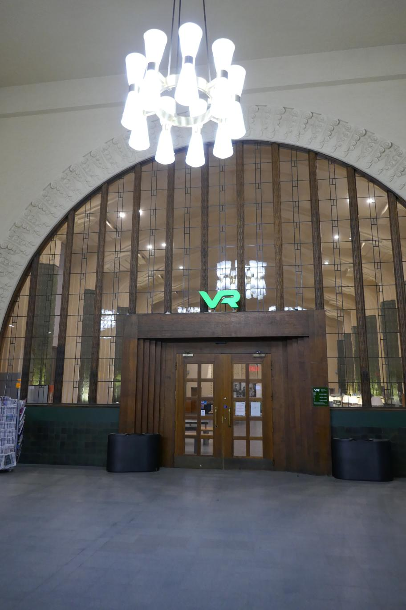

ところで、フィンランド国鉄(VR)のこのロゴ、何かに非常に近い気がするのですが、いかがでしょうか。(色合いは東よりかは北でしょうか)

市内で一泊した後に、一度家に別の航空券で戻りました。で、7月にまた戻ってきて、Oneworld Explorerの旅を再開しました。

## 第2部: ヘルシンキ～リスボン～ロンドン～ドーハ～ロサンゼルス

### 5. AY 1739 (HEL -> LIS)

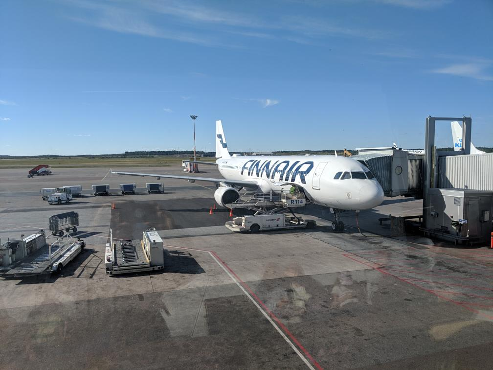

| 項目 | 内容 |
|-----|---------|
| 便名 | AY 1739 |
| 出発地 | ヘルシンキ・ヴァンター国際空港 (フィンランド) |
| 到着地 | リスボン・ウンベルト・デルガード空港 (ポルトガル) |
| 予定 | 18:20 ⭢ 21:10 |
| 実績 | 18:33 ⭢ 21:20 (4h47m) |
| 機種・機体番号 | A321-200 (OH-LZB) |

第2部の最初のセグメントです。前の便と同じく、Finnairのヨーロッパ内ビジネスクラスなので、特筆すべきところはありませんでした。

この路線は季節限定で7月に入らないと運航されないというのが、ヘルシンキで中断した一つの理由です。
もう一つの理由は、一度に全行程を消費しようとすると、一回の休暇が長くなりすぎてしまうことです。
まあ、実際、最初の行程だけでも大分詰め込みすぎていたということもあり、疲れましたから、これくらいが適度なところでしょう。

### 5.5 Sintra

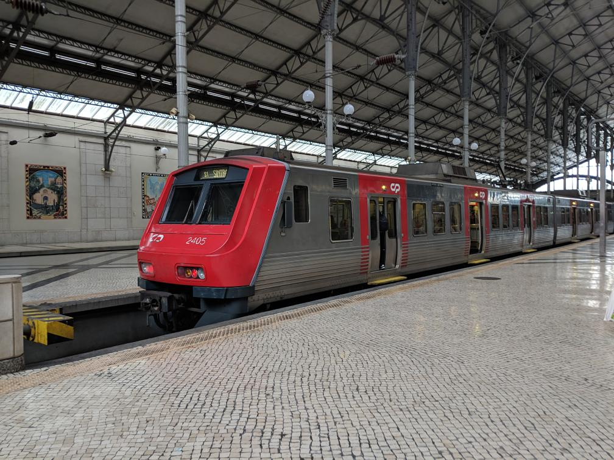

リスボン市内はほぼスルーして、リスボンからなかなかごつい感じの列車に乗って、シントラに行きました。ポルトガルも広軌ですね。

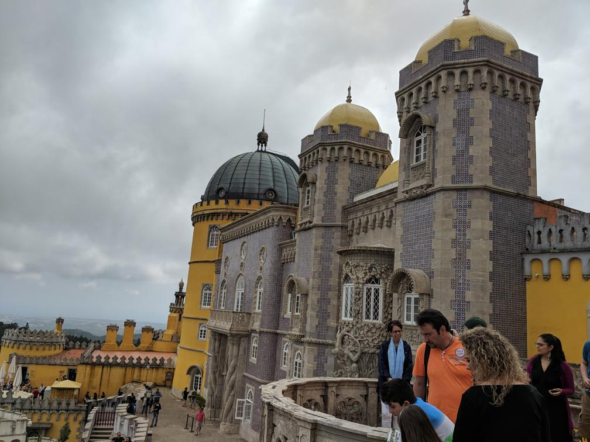

ペーナ宮殿。

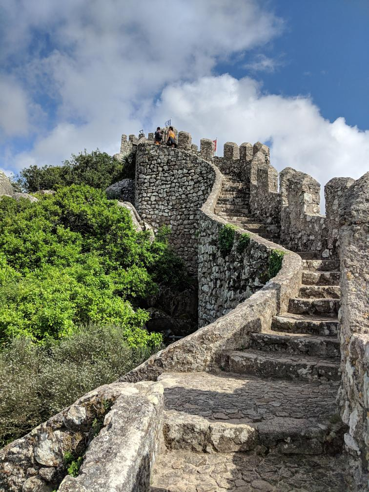

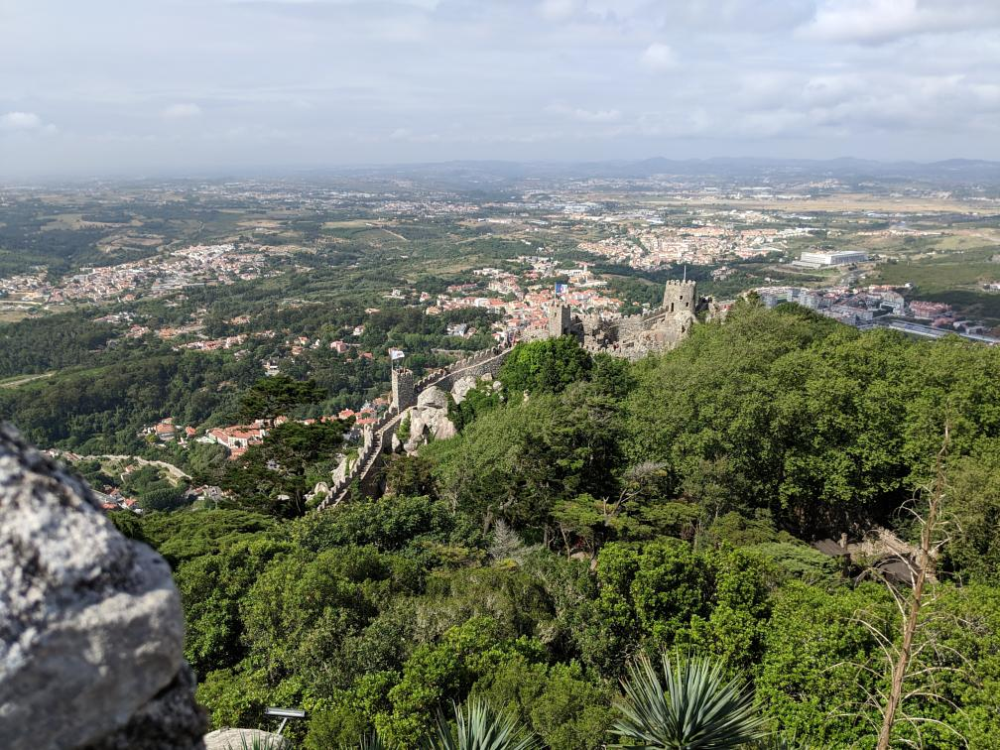

そしてこのヨーロッパ感！(語彙不足)　トレドよりも実はこのムーロス城のほうが感動しました。

宮殿や城は市街から離れたところにあり、バスで向かったのですが、横幅ギリギリの道路を走るので(乗ってる分には)楽しかったです。

### 6. BA 499 (LIS -> LHR)

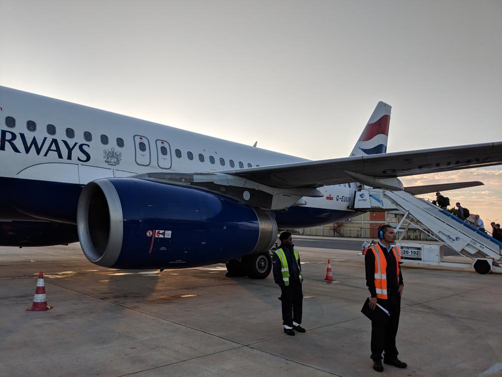

| 項目 | 内容 |
|-----|---------|
| 便名 | BA 499 |
| 出発地 | リスボン・ウンベルト・デルガード空港 (ポルトガル) |
| 到着地 | ロンドン・ヒースロー空港 (イギリス) |
| 予定 | 07:20 ⭢ 10:05 |
| 実績 | 07:18 ⭢ 09:58 (2h40m)|
| 機種・機体番号 | A320-200 (G-EUUV) |

実は、この便は、この数ヶ月前に一度使用したことがありました。リスボン空港はシェンゲン外の路線がそこまで多くなく、かつ朝早い便だったので、出国審査の窓口が一つしか開いておらず、出国審査で結構待たされた経験がありました。
そのため、あまり使いたくない便だったのですが、次のLHR-DOH便の時刻に間に合わせる為にやむなく選ぶこととなりました。

幸いにして、このときは大して待たずにすみました。むしろ、通った後のシェンゲン外の待合ゾーンには、何もないのでぼーっと待つしかありませんでした。

LISではラウンジがありますが、需要の違いなのか出国審査前にしかありません。並ぶ可能性を考えると長居はできません。しょうがないですね。

シェンゲン外を結ぶ路線ではありますが、扱いとしてはシェンゲン内路線と同じ、ヨーロッパ内ビジネスクラスなので、まあ特筆すべきものはありませんでした。

ちなみに、今回は関係ありませんでしたが、BAはヨーロッパ内路線のエコノミークラスは、飲み物すら有料ですので注意しましょう。

### 6.5 London Heathrow

実は、LHRはこれを含めて5回使ったことになるのですが、結局イギリスに入国したことはありません。

Qatar Airwaysのラウンジは非常に豪華でした。食べ物がオーダー制だったのが、逆に面倒でしたが。

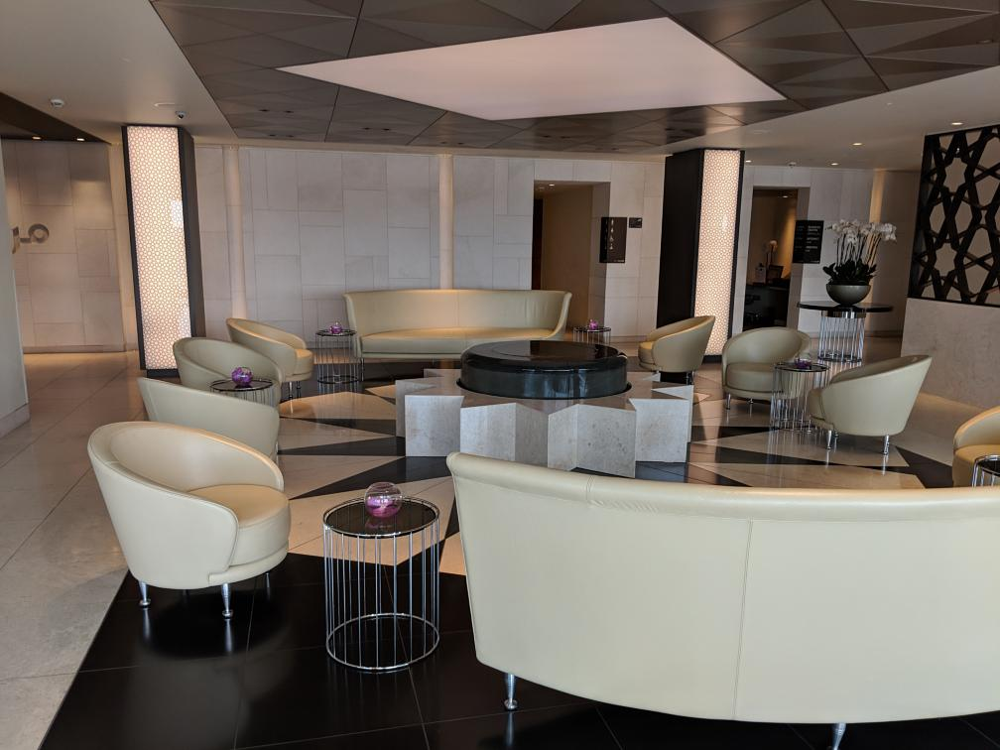

### 7. QR 4 (LHR -> DOH)

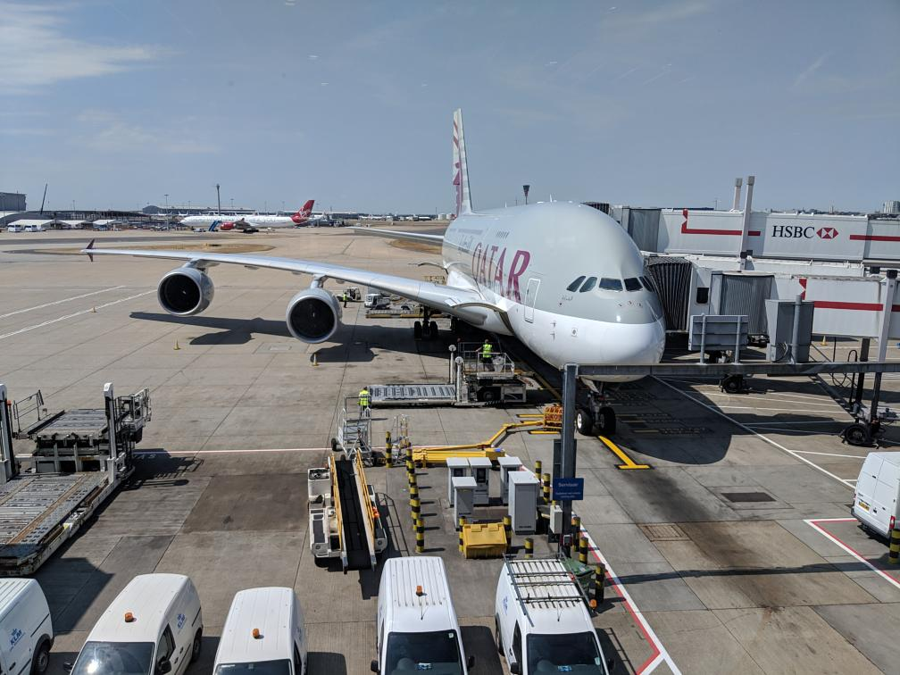

| 項目 | 内容 |
|-----|---------|
| 便名 | QR 4 |
| 出発地 | ロンドン・ヒースロー空港 (イギリス) |
| 到着地 | ハマド国際空港 (カタール) |
| 予定 | 15:05 ⭢ 23:59 |
| 実績 | 15:12 ⭢ 23:59 (6h47m) |
| 機種・機体番号 | A380-800 (A7-APC) |

初めてのQatar Airwaysです。Cathayにもまして丁寧な対応、というか、いろいろな人(3人)から機内で挨拶がありました。
まあちょっとそこまでしなくてもいいのに感がありますが、そういうところが評価の高いエアラインなのでしょう。

A380でしたので非常に広く、また豪華な感じでした。それに対すると次の便(B772)が若干見劣りするのはやむを得ないですね。

で、ドーハは深夜着でしたが、ボーディングブリッジで感じる暑さは、これこそ中東という感じでした。まあターミナル内は、グローバルな空調管理がされているので、それを感じることはありませんでしたが。

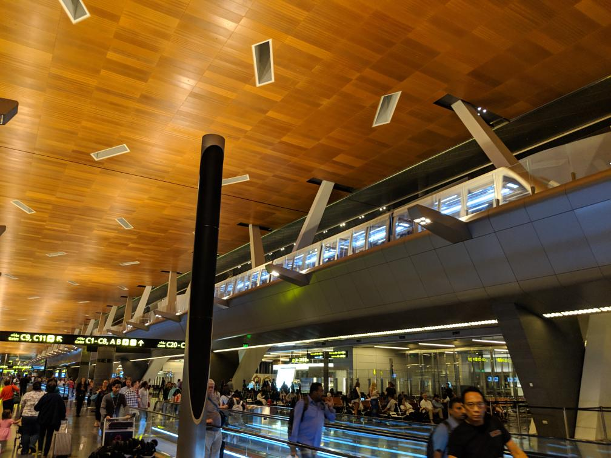

このときの次の便への乗り継ぎ時間が7時間56分でした。これが8時間以上だと、市内のホテルを使うことができるというサービスがQatar Airwaysにあります。とはいえ、できたとしても、入国からホテルまでの移動考えると10時間以上はほしいところですね。

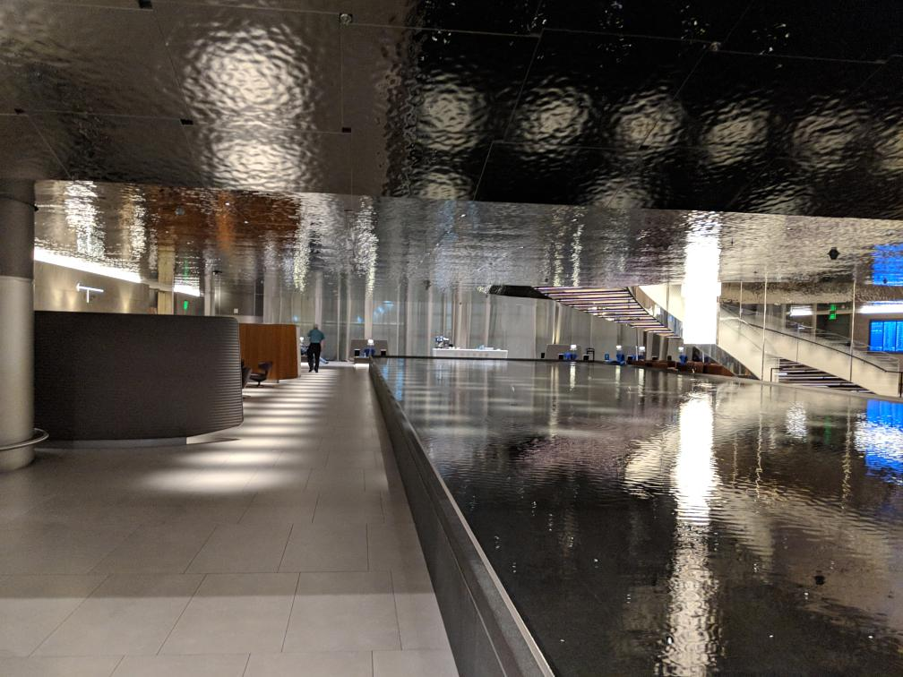

なので、これまた中東系の豪奢なラウンジで過ごしました。

なお、時差ボケ対策にと思って、ラウンジでの待ち時間で寝なかったのが完全な失敗で、次の便が完全な体調不良で過ごす羽目となりました。

### 8. QR739 (DOH -> LAX)

| 項目 | 内容 |
|-----|---------|
| 便名 | QR 739 |
| 出発地 | ハマド国際空港 (カタール) |
| 到着地 | ロサンゼルス国際空港 (アメリカ) |
| 予定 | 07:55 ⭢ 14:00 |
| 実績 | 08:14 ⭢ 14:58 (16h44m) |
| 機種・機体番号 | B777-200ER (A7-BBE) |

間違いなくこの旅程のハイライトです。中東から西海岸まで、16時間超えです。
もちろん、最長路線(EWR-SIN)と比べるとこれでも2時間ほど短いのですが、まあ長いものは長いですね。

前述の通り、体調不良でしたので、食欲がわかず、せっかくの豪華なメニューはほとんど食べておりません。
まあ体調不良というのがあったにせよ、約17時間というのは格が違う長さですね。食べて寝て食べても、まだまだ時間が余るというこのどうしようもなさ。

やはり飛行機は10時間くらいが適切な長さではないでしょうか。

ところで、このフライトのルートを見てみると北回りで、ルール上は渡っているとはいえ、実際は大西洋を渡ったとは言いがたいルートでした。
3次元の球体って難しいですね。

## つづき

さて、長くなってしまったので、[さらに続きます。](#7)

## おまけ

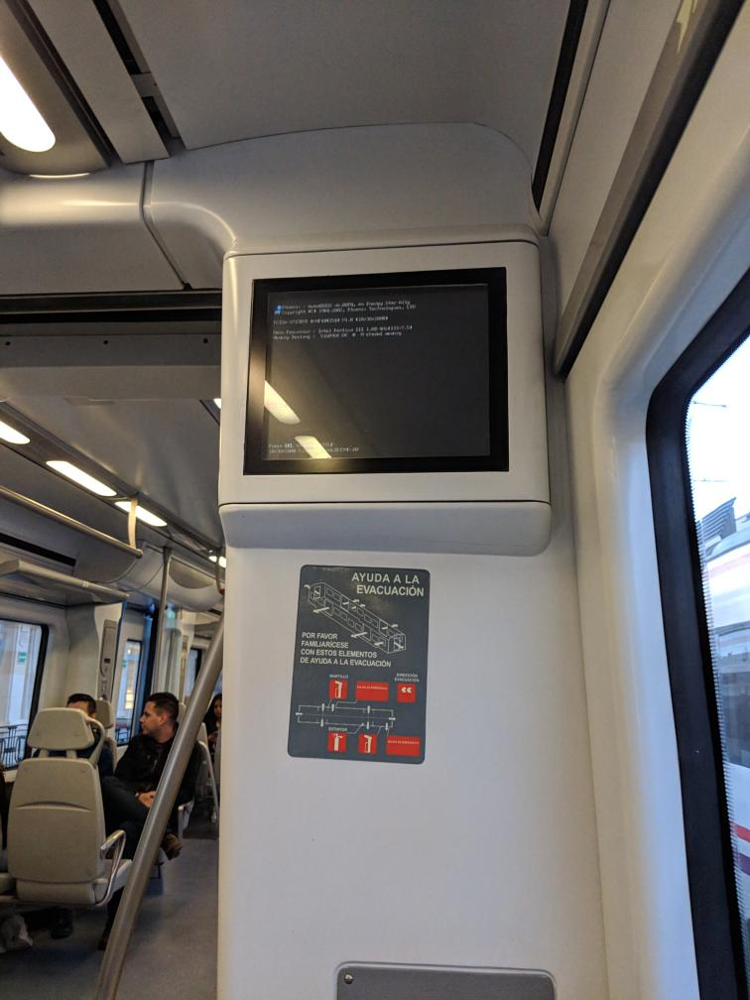

renfe車内にて。
