# Oneworld Explorer - 旅行編 (2)

[旅行編(1)](#6)のさらに続きです。

北米からスタートです。

## 第3部: ロサンゼルス～アンカレッジ～ダラス

### 9. AA 1075 (LAX -> ANC)

| 項目 | 内容 |
|-----|---------|
| 便名 | AA 1075 |
| 出発地 | ロサンゼルス国際空港 (アメリカ) |
| 到着地 | テッド・スティーブンス・アンカレッジ国際空港 (アメリカ) |
| 予定 | 19:30 ⭢ 23:49 |
| 実績 | 19:26 ⭢ 23:46 (5h20m) |
| 機種・機体番号 | B737-800 (N337PJ) |

第3部です。北米の中は1便を除いてすべてAmerican Airlinesです。なのであまりおもしろみがないですね。

国内線ファーストクラス(実質ビジネスクラス)は、ヨーロッパでのヨーロッパ内ビジネスクラスとあんまり変わらなくて、アメリカの航空会社サービスというのも特に悪いと感じなかったのですが、どうなんでしょうか。
記憶が曖昧でこの便がそうだったかは思い出せないのですが、ファーストクラスはフルフラットになる飛行機が使われることも多いので、少なくとも座席という点では十分によいのではないでしょうか。

さて、北米最初の路線は、アラスカ行きです。そして、このOneworld Explorerで最初の国内線チケットです。このロサンゼルス～アンカレッジは季節限定路線で、夏の間しか運航されません。

アンカレッジ到着が23:49となかなかひどい時刻ですが、出発地の時刻(PDT)でいえば21:49だから、体調的にまあぎりぎり許容できるでしょうか。

### 9.5 Anchorage, Seward

ロサンゼルスもそうですが、アメリカに入ると、空港まで鉄道が伸びていることがレアになってきます。ただ到着時刻的には深夜なので、あったとしても使えたかどうかは微妙なラインですが。
アンカレッジは空港からそれなりの距離の場所にあるので、Uberなりホテルの送迎なりタクシーなりを使うことになります。悲しいですね。

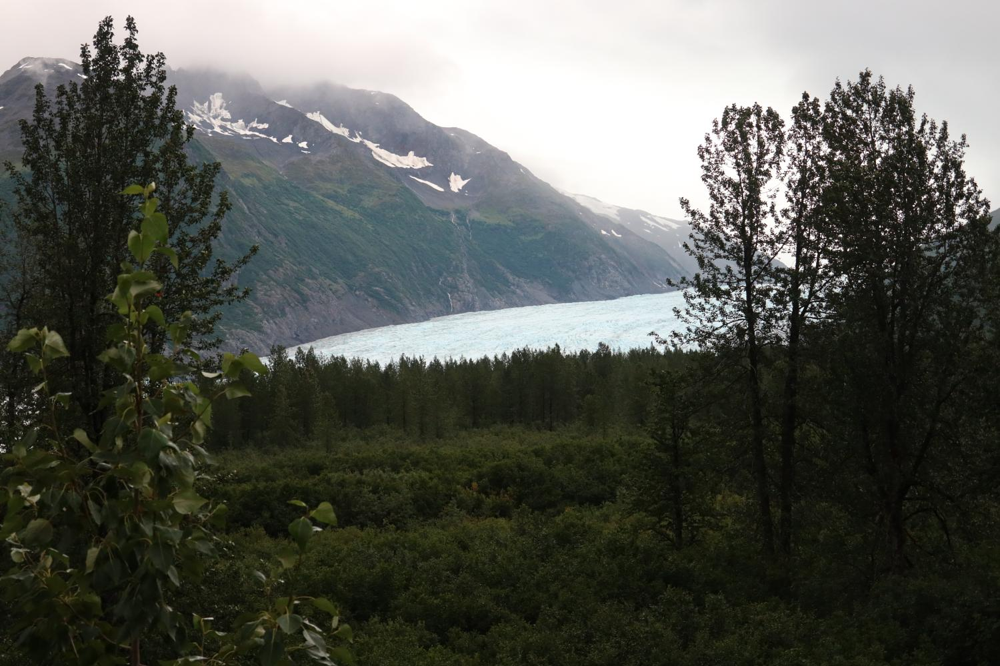

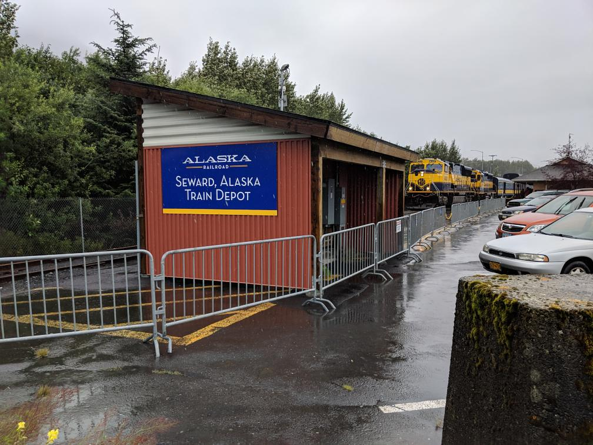

ここでは2泊して、Alaska Railroadに乗ってSewardまで行ったりしました。

### 10. AA 148 (ANC -> DFW)

| 項目 | 内容 |
|-----|---------|
| 便名 | AA 148 |
| 出発地 | テッド・スティーブンス・アンカレッジ国際空港 (アメリカ) |
| 到着地 | ダラス・フォートワース国際空港 (アメリカ) |
| 予定 | 20:35 ⭢ 06:00 |
| 実績 | 20:44 ⭢ 05:45 (6h01m)|
| 機種・機体番号 | B757-200 (N186AN) |

AAのハブであるDFWまでの路線です。アラスカからテキサスというのもなかなか気候がハードに違うところを結んでいますね。（まあ距離が長くなるように路線を選んでるから当たり前なのですが）

さて、アンカレッジ空港の最大の問題は、ラウンジがないことです。
AA自体の上級会員だと、Alaska Airlinesのラウンジが使えた気がしますが、Oneworldのステータスは通用しません。
なので、ビジネスクラス旅行なのに、悲しく搭乗口でぼんやりと待つ羽目になりました。

## 第4部: ダラス～バンクーバー～ニューヨーク～マイアミ

### 10.5 Dallas

第3部のダラスでは、そのまま空港から出ずに家に戻りましたが、第4部で再開するにあたっては一泊しました。

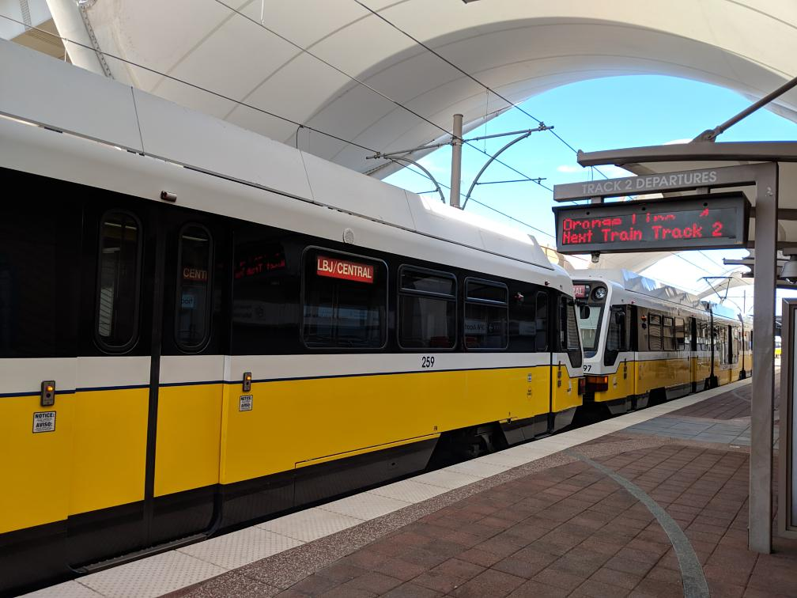

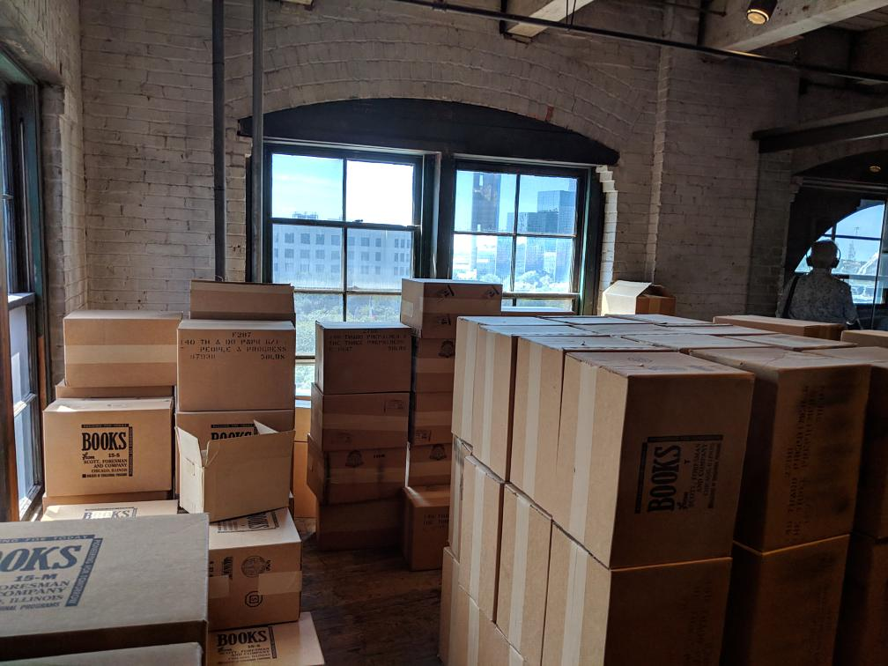

ダラスで何をしたかといえば、ライトレールに乗り、あの事件の記念館まで行っただけでした。

### 11. AA 2263 (DFW -> YVR)

| 項目 | 内容 |
|-----|---------|
| 便名 | AA 2263 |
| 出発地 | ダラス・フォートワース国際空港 (アメリカ) |
| 到着地 | バンクーバー国際空港 (カナダ) |
| 予定 | 16:50 ⭢ 19:08 |
| 実績 | 17:06 ⭢ 19:23 (4h17m) |
| 機種・機体番号 | B737-800 (N935NN) |

第4部です。
北米内移動ですが、忘れてはいけないことに、アメリカ以外にももう一つ国があります。(Oneworld Explorerのカテゴリ的には、中米も入るので、本当はもっといっぱいありますが)

ということで、カナダ行きの国際線なのですが、アメリカからの出国は明示的な手続きがないため(航空会社のカウンターでやることになる)、AAということもあり国内線とあまりノリは変わりませんでした。
Document checkが必要なため、ゲートのカウンターに長い列ができていたのが大きな違いでしょうか。

なお、自分はチェックインカウンターで行っていたのでゲートで行う必要はありませんでした。
ただ、ダラスのAAのチェックインカウンターの担当者が、eTAをちゃんと分かっていない感じで時間がかかりましたが・・
(アメリカ市民権保有者はカナダ入国にeTAいらないですからね)

### 11.5 Vancouver

で、初めてのカナダです。バンクーバー空港では、今回の旅行では一番きびしい入国審査を受けました（といっても、質問が多少多かっただけですが）。

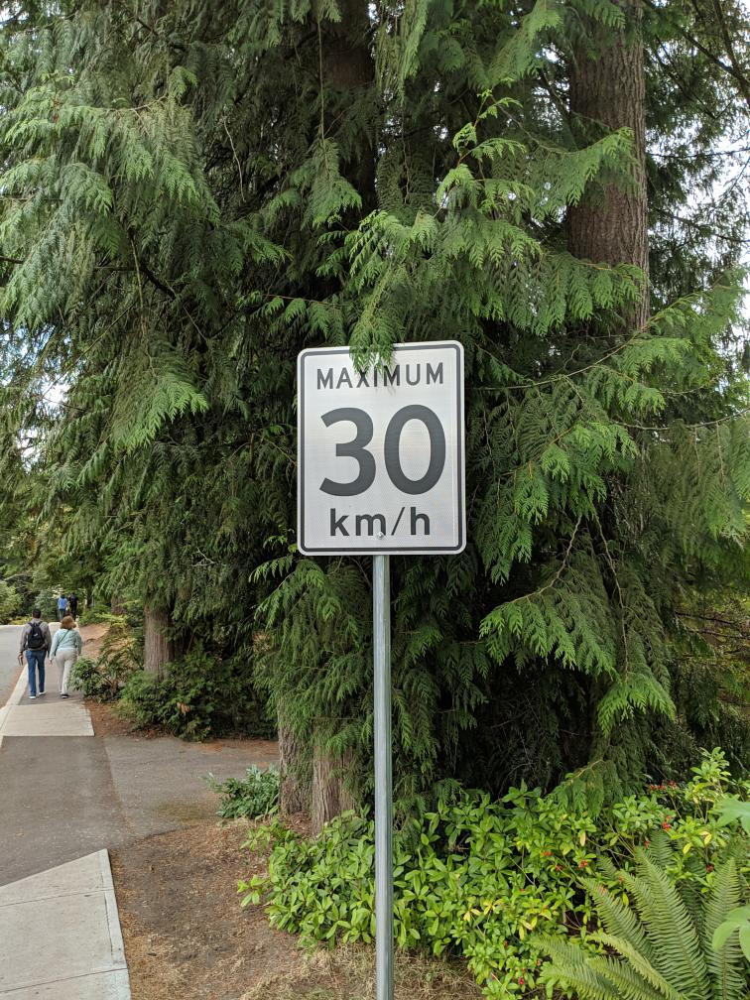

バンクーバーは、確か自動運転としては最長の路線網を持っており、道路の制限速度の表記がkm/hであることなど、お隣の国(特に同じ西海岸なのに・・・)との文明レベルの違いを感じます。

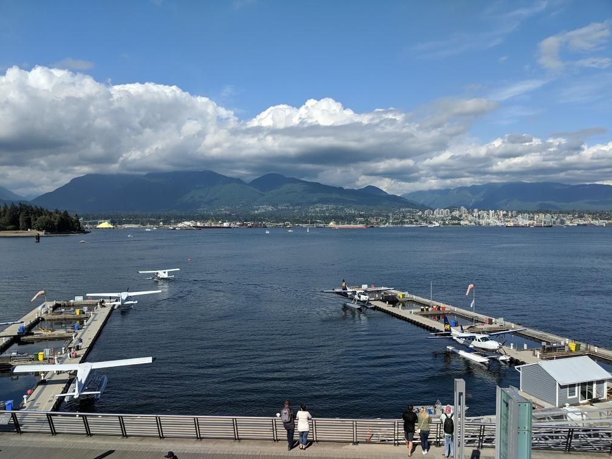

水上飛行機は単発しかないと思っていたので乗ることは考えなかったのですが、後で調べて双発もあることがわかったので、
次に行くことがあれば乗ってみたいと思います。

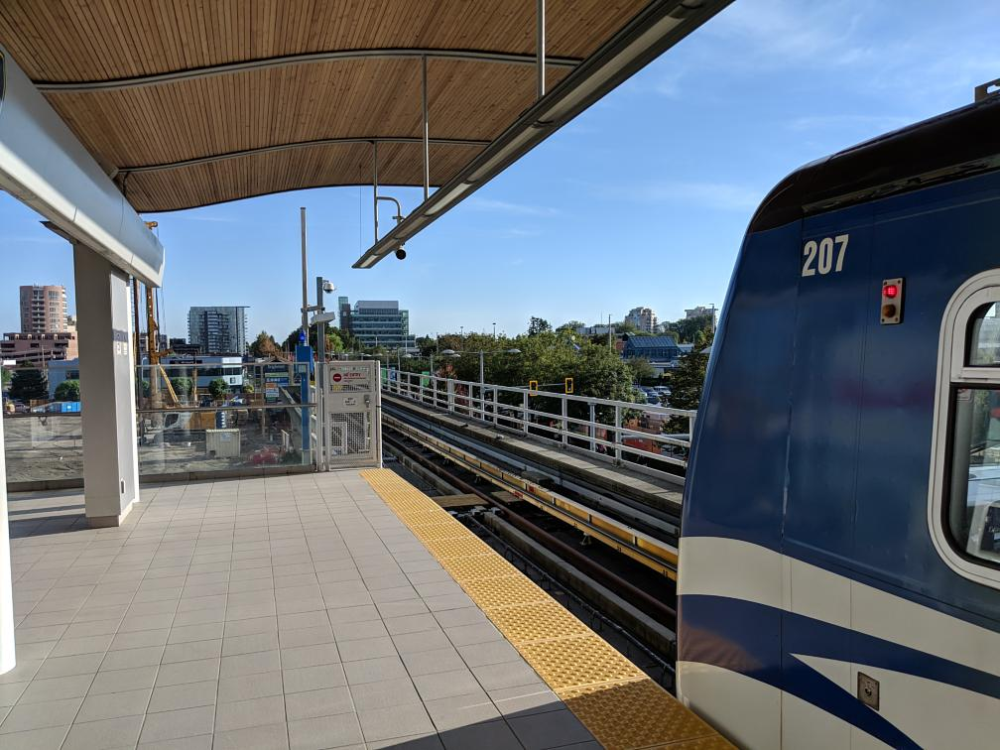

もちろんメトロは乗りつぶしました。

### 12. CX 888 (YVR -> JFK)

| 項目 | 内容 |
|-----|---------|
| 便名 | CX 888 |
| 出発地 | バンクーバー国際空港 (カナダ) |
| 到着地 | ジョン・F・ケネディ国際空港 (アメリカ) |
| 予定 | 22:55 ⭢ 07:00 |
| 実績 | 22:51 ⭢ 06:52 (5h01m) |
| 機種・機体番号 | B777-300ER (B-KQG) |

ここで突然のCathayです。CX 888は、前の記事でも書いた通り、香港発バンクーバー経由ニューヨーク行きで、その一部区間だけでも乗ることができます。
そのため、北米内の区間であるにもかかわらず、Cathayで飛ぶことができます。

もちろん長距離用の機材ですので、フルフラットですし、食事のサービスなども太平洋路線と変わるところはありません。

ただ、そうはいっても5時間程度の飛行時間ですので、ちゃんと食事をした上で寝ようとすると3時間程度しか寝る時間がありません。
こういうチケットの一つに組み込むとお得ですけど、そうでない場合には、逆にもったいない感じがしますね。

なお、カナダの多くの空港では、アメリカの入国審査を出発時に行うPre-clearanceがあり、当然バンクーバーにもあるのですが、この路線は、その性格上ただの国際線としての扱いとなります。
つまり、バンクーバーではカナダの出国手続きのみで、ニューヨークでアメリカの入国審査を受けることになります。初めてのPre-clearanceにちょっと期待していたのですが、残念でした。
なお、同じ時間帯のAAのアメリカ行きも同じゾーンのゲートから出発しており、Pre-clearanceの対象時間帯以外(つまり早朝や深夜)では、他の路線でもアメリカでの入国審査となるということを知りました。

今回の計画にあたっては、アメリカの入国審査や飛行機の遅延も加味して、JFKからの乗り継ぎの便は思いっきり余裕あるものにしました。(もちろん、一連のチケットなので、万が一乗り遅れても次の便などに振り替えてくれるはずですが)
幸いにして飛行機はほぼ定時、入国審査も1時間かからないくらいでしたので、時間が余ってしまいました。
(ところで、JFKの入国審査官や税関は、西海岸の人たちよりフレンドリーな感じがしました)

ターミナル移動をどのみちしなくてはならず、国際線→国内線は必ずセキュリティを通らなければならず、どのみち制限区域外に出てしまったのだからということで、初めてMTAに乗ってきました。

### 12.5 New York?

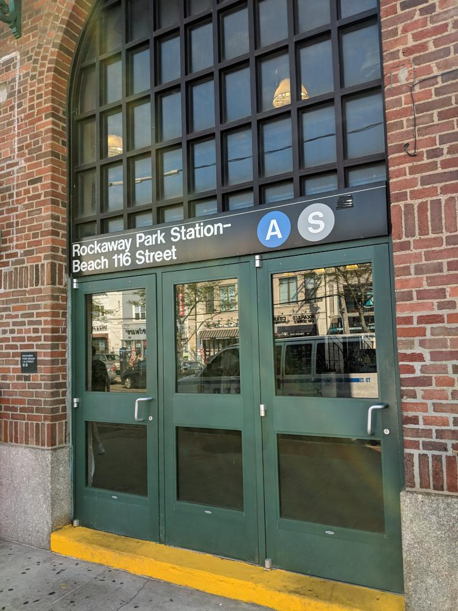

といっても、マンハッタンまで行く時間的余裕はなかったので(単純往復ならできたかもしれないですが)、A線のマンハッタンとは反対側の終点まで行ったりしました。なお、工事のため、普段は支線のほうが終点になっていましたので、本来のA線の終点には行きませんでした。

しかし、線形がそんなによくなかったりして、路線図で見るよりも時間がかかったり、そもそも路線数も多いですし、ニューヨーク地下鉄の乗りつぶしは本当に大変そうだなあと実感しました。

やりませんよ？たぶん。

### 13. AA 2572 (JFK -> MIA)

| 項目 | 内容 |
|-----|---------|
| 便名 | AA 2572 |
| 出発地 | ジョン・F・ケネディ国際空港 (アメリカ) |
| 到着地 | マイアミ国際空港 (アメリカ) |
| 予定 | 13:15 ⭢ 16:26 |
| 実績 | 13:08 ⭢ 15:58 (2h50m) |
| 機種・機体番号 | B757-200 (N185AN) |

JFKに戻ってターミナル 5に来ました。さすがにニューヨークの空港なので人がいっぱいだろうと思いましたが、なんだか意外とがらんとしていました。
セキュリティとかもそんなに並びませんでしたし。広いせいなんでしょうか。

とはいえ、ニューヨークですから、AAのFlagship Loungeがありました。

JFK-MIAは、なぜか大陸横断路線で使われるような機材(フルフラットになる)でした。運用の都合なのでしょうか。
なお、タイムゾーンが変わらない久しぶりのフライトでした。

この季節のフロリダとしてはよくあることでハリケーンが近づいており、雨や風が結構ひどかったです。
翌日のMIAからの帰り(別航空券)が、特に問題なく飛んだのは幸いでした。

## 第5部: マイアミ～ボストン～香港～東京

### 13.5. Miami

第4部の終わりではハリケーンなどがあり、時間にも余裕がなかったので、空港とホテルの往復で終わりました。
第5部の再開にあたっては、ダラスと同様に1泊しました。

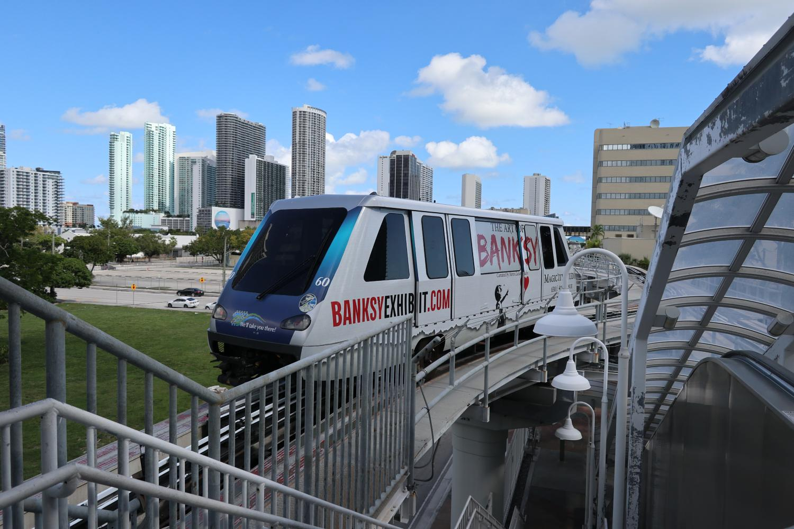

天気も良く時間もあったので、マイアミのMetrorailとMetromoverを乗りつぶしました。このほかにも通勤路線があるのですが、さすがにそれは距離が長いので今回は乗りませんでした。
Metrorailは、どういうわけかATSに引っかかって急停車するような挙動が何回も続けてあり、いろいろと大丈夫なんだろうかと思うアメリカの鉄道でした。

### 14. AA 2656 (MIA -> BOS)

| 項目 | 内容 |
|-----|---------|
| 便名 | AA 2656 |
| 出発地 | マイアミ国際空港 (アメリカ) |
| 到着地 | ジェネラル・エドワード・ローレンス・ローガン国際空港 (アメリカ) |
| 予定 | 19:40 ⭢ 22:50 |
| 実績 | 19:42 ⭢ 22:54 (3h12m) |
| 機種・機体番号 | B737-800 (B-KQK) |

第5部です。ボストン行きです。そして、このOneworld Explorer最後のAAでした。
このフライト自体は特筆すべきことはやはりないです。

### 14.5 Boston Logan Airport

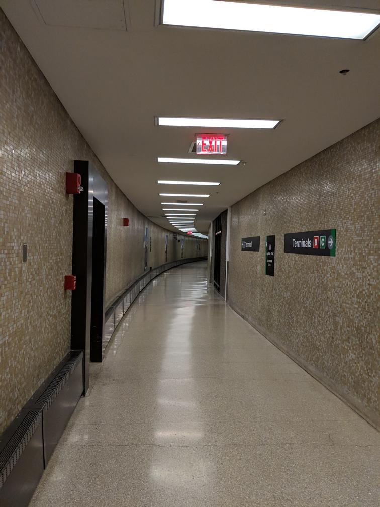

ボストンは、古い空港によくあることですが、ターミナル間がセキュリティ内でつながっていないので、一度外に出て歩くことが必要でした。
夜遅かったせいか人が少ないこともあり、いろいろと本当にあってるのかと不安になるようなターミナル間移動でした。

ほかにもボストンからたくさん深夜から出るのかとてっきり思っていましたが、たしか1時以降に出るのがこの便含めて2つか3つくらいしかなく、
国際線ターミナルはかなり閑散としていました。

それでも、Cathayは独自のラウンジを持っておりました。シャワーもありましたし、ヌードルバーもあった気がします。

### 15. CX 811 (BOS -> HKG)

| 項目 | 内容 |
|-----|---------|
| 便名 | CX 811 |
| 出発地 | ジェネラル・エドワード・ローレンス・ローガン国際空港 (アメリカ) |
| 到着地 | 香港国際空港 (香港) |
| 予定 | 01:30 ⭢ 06:00 |
| 実績 | 01:31 ⭢ 05:50 (15h19m) |
| 機種・機体番号 | B777-300ER (B-KQK) |

そして、このフライトもかなり長いです。ルートも、北回りでどちらかというと東寄りの向きでしたので、これまたルールにある大西洋横断も
実際にはしていない（そもそも西向きにすら行っていない）のではないかと感じました。

まあ長距離路線はたいていは地球を半周したところにあるので、同じ半球にあるとこういうルートになることが多くなりそうです。

### 15.5 香港

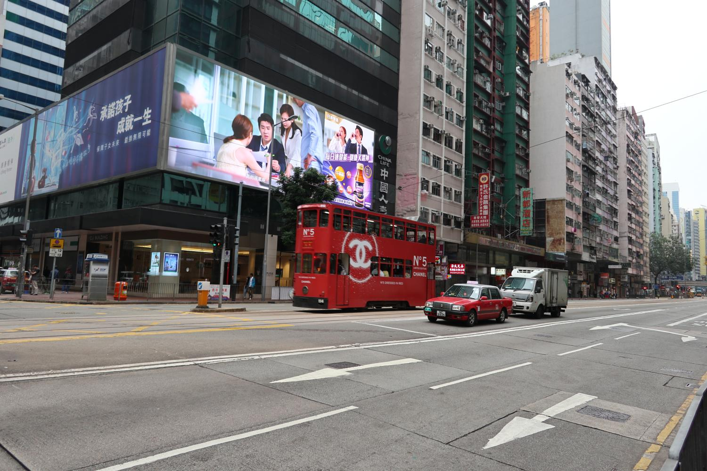

ヨーロッパや北米と比べると、やっぱりアジアですね。店も日本のチェーン店が結構ありますし。

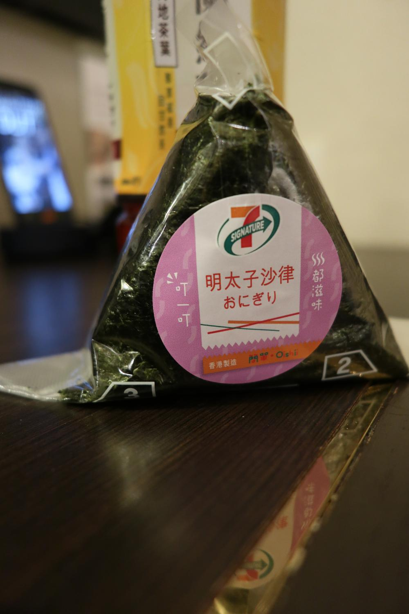

セブンイレブンで、日本語の書かれたおにぎりやサンドイッチを買うという所業ができてしまいます。

香港のMTRを何路線か乗りつぶしたりしました。

### 16. JL 736 (HKG -> NRT)

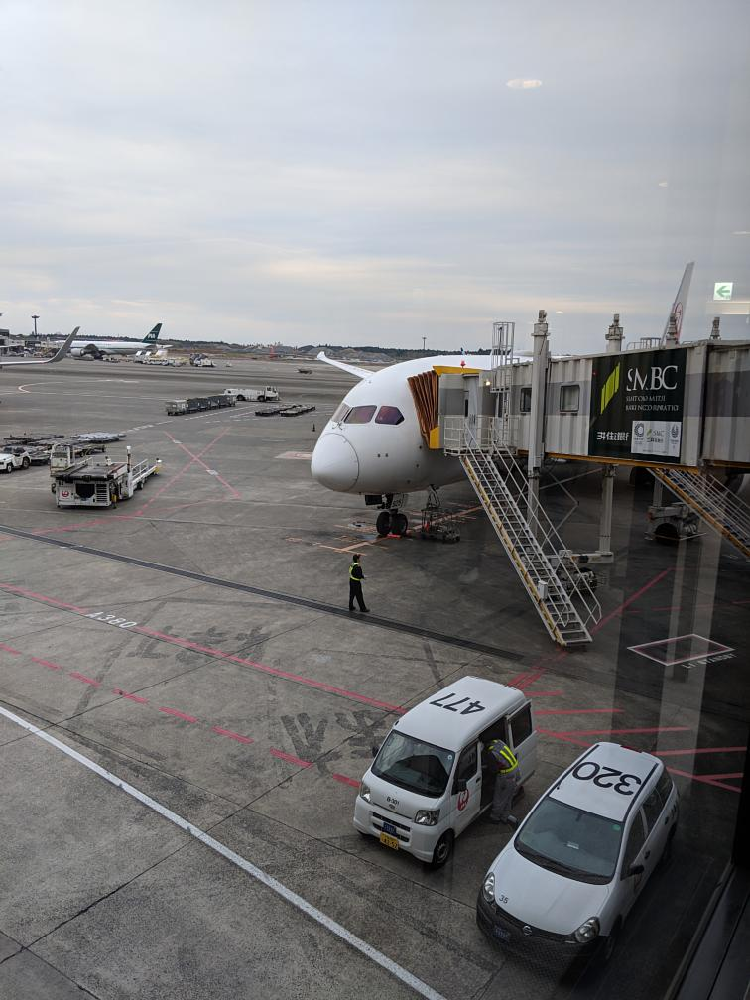

| 項目 | 内容 |
|-----|---------|
| 便名 | JL 736 |
| 出発地 | 香港国際空港 (香港) |
| 到着地 | 成田国際空港 (日本) |
| 予定 | 10:20 ⭢ 15:20 |
| 実績 | 10:20 ⭢ 15:18 (3h58m) |
| 機種・機体番号 | B787-8 (JA825J) |

最後の締めはもちろんJALです。たったの4時間ですから誤差みたいなものですね。

## まとめ

まあ旅行記なのでオチも何もないのですが、そもそも第一の目的がFOPをたくさん取得することでしたので、観光成分は薄目となりました。
とはいえ、それでも、結構いろいろなところを見て回ることができたと実感しています。
もっとまともな理由でこのOneworld Explorerを使えば、より楽しく濃密な旅行ができること請け合いです。

そんなわけで、航空会社の回し者ではありませんが、FOPが欲しい人もそうでない人も、ぜひともOneworld Explorerを使って世界一周旅行をすることをおすすめいたします！

え、もう一回？　もう1, 2年くらいしたらやってもいいかな・・・と思っていたら、もうすぐ2020年です。少しコンセプトを変えて再チャレンジしてみたい気分になってきました。
はてさてどうなるやらです。

## おまけ

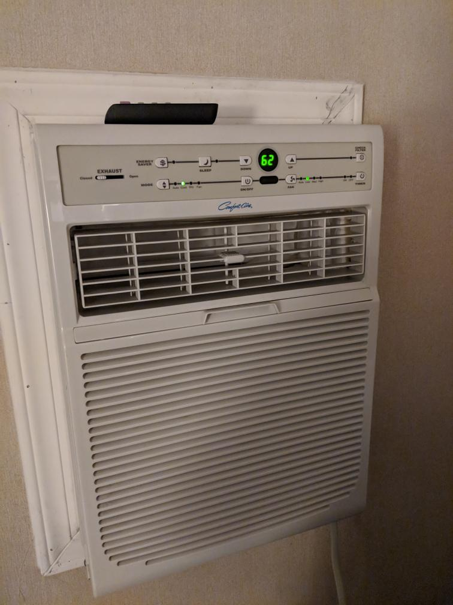

アンカレッジのホテルで、62F(16.7C)でクーラーが付いているという初めての事態に遭遇しました。自分が経験した中で最低温度です。
